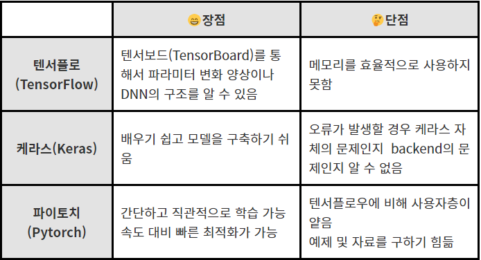

# 딥러닝 공부

책 : 모두의 딥러닝 - 조태호지음, 밑바닥부터 시작하는 딥러닝- 한빛미디어

사이트 : 당근마켓 개발자 사이트, 네이버 개발자 사이트

### 1장. 딥러닝 준비운동

#### 딥러닝에서의 

 - 데이터는
    - 딥러닝은 데이터를 통해 예측 혹은 판별의 역할을 수행한다. 
    - 라밸링의 여부에 따라 '지도학습'과 '비지도학습' 으로 나뉜다
       - 지도학습 : 데이터에 대한 분류(라벨)이 되어있는 대부분이 경우
       - 비지도 학습 : ex) GAN과 오토인코더
 - 컴퓨터
   	- CPU와 GPU 두 가지 모두 딥러닝이 가능하지만 단순하게 많은 양의 데이터에 대하여 간단한 동일 작업을 할 경우 GPU에서 작업하는 것이 훨씬 좋다. 
      	- 이유는 GPU의 특성과 관련이 있는데 모니터에 점을 찍는 단순한 작업을 쿠다(엔디비아)라고하는 계산 코어가  몇천개가 동시에 동일 작업을 진행해 주는 방식인데 이것이 딥러닝에서 학습하는 부분과 비슷한 부분이 많기 때문이다.
   	- 근래에는 딥러닝만을 위한 GPU도 출시 하고 있다.

#### 딥러닝 프레임워크

1. 텐서플로(tensorflow)

   1. 특징 : 구글에서 만든 오픈소스 소프트웨어 라이브러리이며 데이터 플로우 그래프 구조를 사용한다. 

      1. 데이터 플로우 그래프 구조 : 데이터의 흐름을 노드와 엣지를 사용한 방향성 그래프로 표현하는 방식 

         노드 사이의 연결이나 다차원 배열등을 의미하는 텐서 사이의 연결관계를 표현할 수 있다.

   2. 장점 : 이미지 인식, 반복 신경망, 기계 번역, 필기 숫자판별에 사용

       대규모 예측 모델 구성에 뛰어남.  

      구글에서 전폭적인 지원, 지속적인 성능 개선과 빠르고 안정적.

      추상화 수준이 높아 알고리즘의 세세한 구현 << 전체적인 논리

      확장성이 뛰어남

   3. 단점 : 모델의 기초 레벨부터 작업해야해서 초보자가 어려울 수 있다. 유기적인 신경망을 만들 수 없어 성능의 한계를 가지고 있다.

   

2. 케라스(keras)

   1. 특징 : 텐서플로의 문제를 해결하기 위하여 단순화된 인터페이스를 제공함. 시퀀스 모델로 원하는 레이어를 쉽게 순차적으로 쌓을 수 있다. 다중 출력 등 복잡한 모델 구성시 케라스 함수 API를 사용하여 쉽게 구성 가능함. 
   2. 장점 : 일반 사용 사례에 최적화된 간단하고 일관 된 인터페이스를 제공. 사용자 오류에 대해 명확하고 실용적인 피드백을 제공함. 케라스의 구성 요소는 모듈 형태로, 각 모듈이 독립성을 갖기 때문에 새로운 모델을 만들 때 각 모듈을 조합해 쉽게 새로운 모델을 만들 수 있다.
   3. 단점 : 모듈화의 한계로 복잡한 프로젝트에 구현이 어려움. 다양한 백엔드 위에 동작하기 때문에 오류 발생시 디버깅이 어려움

   

3. 파이토치(pytorch)

   1.  특징 : 페이스북 AI연구팀이 개발한 파이썬 기반 오픈소스 머신러닝 라이브러리. 텐서플로보다 절차가 간단하고 그래프가 동적으로 변화가능하며 파이썬과 유사하다.
   2.  장점 : 그래프를 만들면서 동시에 값을 할당하는 방식으로 코드가 깔끔하고 직관적이다. 학습속도가 빠르다.  메모리에서 연산을 하며 신경망 사이즈를 최적으로 바꾸면서 동작이 가능하다. Numpy를 대체하면서 GPU를 이용한 연산이 가능하며 유연하고 빠르다.
   3. 단점 : 텐서플로에 비해 사용자층이 낮고 학습에 필요한 자료와 예제를 구하기 쉽지 않음

   

[출처 : https://hongong.hanbit.co.kr/%EB%94%A5%EB%9F%AC%EB%8B%9D-%ED%94%84%EB%A0%88%EC%9E%84%EC%9B%8C%ED%81%AC-%EB%B9%84%EA%B5%90-%ED%85%90%EC%84%9C%ED%94%8C%EB%A1%9C-%EC%BC%80%EB%9D%BC%EC%8A%A4-%ED%8C%8C%EC%9D%B4%ED%86%A0%EC%B9%98/]()

